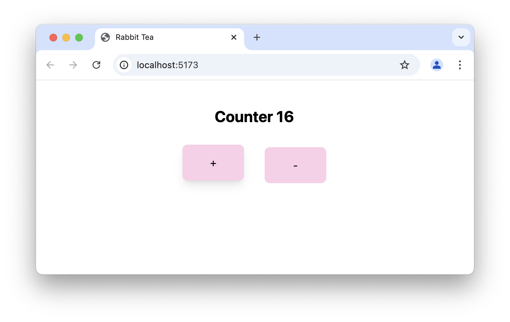

# rabbit-tea-tailwind4 template

Template for web app using MoonBit, Rabbit-TEA, and Tailwind CSS v4.



Modified from the [rabbit-tea-tailwind](https://github.com/Yoorkin/rabbit-tea-tailwind) template.

## Getting started

To get better completion experience in Visual Studio Code, you can install 
the [Tailwind CSS IntelliSense extension](https://marketplace.visualstudio.com/items?itemName=bradlc.vscode-tailwindcss).

Clone this repository and run the following commands in the project directory:

```
npm install
npm run dev
```
